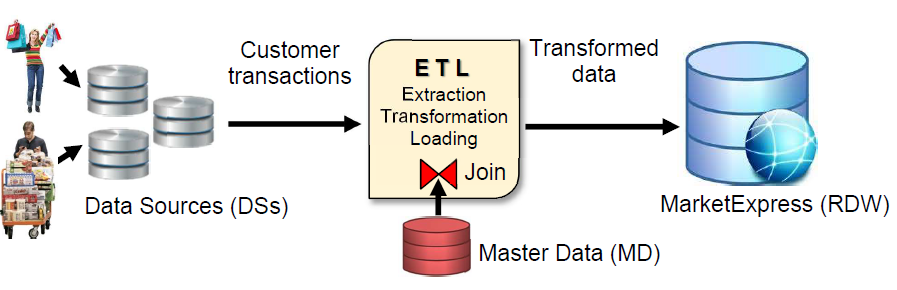
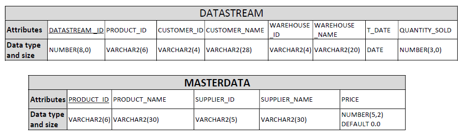

# Building and Analysing a Data Warehouse Project
This repository showcases my assignment project of building and analysing a data warehouse(DW) for a online sale website. The purpose of building the DW was to analyse the shopping behaviour of their customers in the future by using multidimensional data anlysis. The implementation of all SQL code was done on Oracle SQL developer which was connected to my university account.

The repository consist of three parts:

Part 1 : build a DW using star schema

Part 2 : enrich customer transaction data and store in DW

Part 3 : conduct multidimensional data analysis using OLAP queries

## Part 1 : Build a DW using star schema
The assignment project provide a script file named "DataStream_MasterData_Creator.sql". By executing the script it will create two tables in your account. One is DATASTRAM table with 10,000 records populated in it.  This data was generated randomly based on 100 products, 50 customers, 10 warehouses, and one year time period as a date - from 01-Jan-19 to 31-Dec-19. The values for the quantity attribute will be random between 1 and 10. The other is MASTERDATA table with 100 records in it. The structure of both tables with their attribute names and data types is given in the figure below. The attributes DATASTREAM_ID and PRODUCT_ID are primary keys in DATASTREAM and MASTERDATA tables respectively.

Based on the specification of given transaction data and master data, By using star schema I created the fact tables SALES along with five dimensional tables which are CUSTOMER, DATE_TIME, PRODUCT, WAREHOUSE, SUPPLIER. The file named CreateDW.sql producesthe following schema containing fact table and dimensional tables. 

## Part 2 : Enrich customer transaction data and store in DW
 
