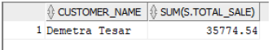

# Building and Analysing a Data Warehouse Project
This repository showcases my assignment project of building and analysing a data warehouse(DW) for a online sale website. The purpose of building the DW was to analyse the shopping behaviour of their customers in the future by using multidimensional data anlysis. The implementation of all SQL code was done on Oracle SQL developer which was connected to my university account.


The repository consist of three parts:

Part 1 : build a DW using star schema

Part 2 : enrich customer transaction data and store in DW

Part 3 : conduct multidimensional data analysis using OLAP queries

## Part 1 : Build a DW using star schema
The assignment project provide a script file named "DataStream_MasterData_Creator.sql". By executing the script it will create two tables in your account. One is DATASTRAM table with 10,000 records populated in it.  This data was generated randomly based on 100 products, 50 customers, 10 warehouses, and one year time period as a date - from 01-Jan-19 to 31-Dec-19. The values for the quantity attribute will be random between 1 and 10. The other is MASTERDATA table with 100 records in it. The structure of both tables with their attribute names and data types is given in the figure below. The attributes DATASTREAM_ID and PRODUCT_ID are primary keys in DATASTREAM and MASTERDATA tables respectively.

Based on the specification of given transaction data and master data, By using star schema I created the fact tables SALES along with five dimensional tables which are CUSTOMER, DATE_TIME, PRODUCT, WAREHOUSE, SUPPLIER. The file named CreateDW.sql producesthe following schema containing fact table and dimensional tables. 


## Part 2 : Enrich customer transaction data and store in DW
To implement this enrichment feature in the transformation phase of ETL we need a join operator typically called Semi-Stream Join (SSJ). There are a number of algorithms available to implement this join operation however, the simplest one is Index Nested Loop Join (INLJ).

To implement INLJ algorithm, the following steps are imeplemented.

1. Read 100 tuples from DATASTREAM table as input data into a cursor. The cursor is a user defined data type in PLSQL which works as a list and is used to store multiple records in memory for processing.

2. Read the cursor tuple by tuple and for each tuple retrieve the relevant tuple from MASTERDATA table using PRODUCT_ID index and add the required attributes (mentioned in Figure 2) into the transaction tuple (in memory).

3. The transaction tuple with new attributes (enriched tuple) is to be loaded into DW. Before loading the tuple into DW you will check whether the dimension tables already contain this information. If yes, then only update the fact table otherwise update the required dimension tables and the fact table.

4. Repeat steps 1 to 3 until all the data from TRANSACTIONS table is enriched and loaded to DW.

The file named "ENRICHMENT.sql" contains PL/SQL that implement above steps to populate the DW.

Firstly, "enrichementinlj" procedure is created to implement INLJ for enrichment purpose. Inside the procedure, cursor is created and indexed join with "product_id". It has all the columns of both table datastream and masterstream. And PL/SQL table called "t_cursor_records" is created whose data type is row type of v_cursor. Then "v_cursor_records" pl/sql table is created. Secondly, to simplify the process of inserting data into 5 dimensional tables and 1 fact table with 100 tuples from datastream table, I use bulk collect and "forall" features of PL/SQL. This will process entire list of 100 tuples from datastream with "LIMIT" clause of data_size 100 when inserting data into tables. Lastly, to check whether data is inserted into tables or not, I use "where not exits (select null from tables )" before loading data into DW.

## Part 3 : Multidimensional data analysis
Once the entire data has been loaded into DW, some analysis to the DW using OLAP queries were applied. All the SQL code can be found in QueriesDW

1. To determine the top 3 products in Dec 2019 in terms of total sales, queries as following is used:

```SQL
SELECT p.product_name, sum(s.total_sale),
RANK() OVER (ORDER BY sum(s.total_sale) DESC) AS RANK
FROM product p, date_time d, sales s
WHERE p.product_id = s.product_id
AND d.date_id = s.date_id
AND d.time_year = 2019
AND d.time_month = 12
GROUP BY p.product_name, d.time_year, d.time_month
FETCH FIRST 3 ROWS ONLY;
```


2. To determine which customer produced highest sales in the whole year:

```SQL
SELECT c.customer_name, sum(s.total_sale)
FROM customer c, date_time d, sales s
WHERE c.customer_id = s.customer_id
AND d.date_id = s.date_id
AND d.time_year = 2019
GROUP BY c.customer_name, d.time_year
ORDER BY sum(s.total_sale) DESC
FETCH FIRST ROW ONLY;
```


3. How many sales transactions were there for the product that generated maximum sales revenue in 2019?

```SQL
SELECT p.product_name, supplier.supplier_name, count(s.product_id), sum(s.quantity_sold),
RANK() OVER (ORDER BY sum(s.total_sale) DESC) AS RANK
FROM product p, supplier, sales s, date_time d
WHERE p.product_id = s.product_id
AND supplier.supplier_id = s.supplier_id
AND time_year = 2019
GROUP BY p.product_name, supplier.supplier_name ,d.time_year
FETCH FIRST ROW ONLY;
```


4.Present the quarterly sales analysis for all warehouses using drill down query concepts.

```SQL
SELECT w.warehouse_name,
SUM(CASE WHEN TO_CHAR(d.t_date,'Q') = 1 THEN s.total_sale END) Q1_2019,
SUM(CASE WHEN TO_CHAR(d.t_date,'Q') = 2 THEN s.total_sale END) Q2_2019,
SUM(CASE WHEN TO_CHAR(d.t_date,'Q') = 3 THEN s.total_sale END) Q3_2019,
SUM(CASE WHEN TO_CHAR(d.t_date,'Q') = 4 THEN s.total_sale END) Q4_2019
FROM warehouse w, date_time d, sales s
WHERE w.warehouse_id = s.warehouse_id
AND d.date_id = s.date_id
AND d.time_year = 2019
GROUP BY w.warehouse_name;
```


5. Create a materialised view named “Warehouse_Analysis_mv” that presents the productwise sales analysis for each warehouse.

```SQL
CREATE MATERIALIZED VIEW Warehouse_Analysis_mv
BUILD IMMEDIATE
ENABLE QUERY REWRITE
AS SELECT w.warehouse_id, p.product_id, SUM(s.total_sale)
FROM warehouse w, product p, sales s
WHERE w.warehouse_id = s.warehouse_id
AND p.product_id = s.product_id
GROUP BY ROLLUP(w.warehouse_id, p.product_id);
```


### Self-refection: 
Using ROLLUP function, we can see the output consist of the total sale of each particular warehouse generated and the total sale of each product from the particular warehouse. As for the example, warehouse ID s-1 has total sale of its all products 81700.52 and warehouse ID s-2 has total sales of its all products 163040.04. Using this information, we can compare and evaluate how different warehouses operate and perform according to their total sales and make decisions that match the business interest. What is more, the output can also allow us view what product in the warehouse has higher volume of sales comparing in the other warehouse. Based on which we can make decision such as increase the inventory of that product in the specific warehouse.
